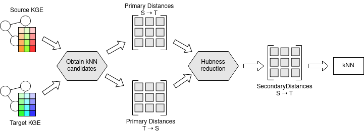

Architecture
============

Using the knowledge graph embeddings (KGE) of source and target entities the k nearest neighbor (kNN) retrieval of kiez relies on three steps:

    1. Obtain k nearest neighbor candidates, based on primary distance (e.g. cosine)
    2. Acquire hubness reduced distance (also called secondary distance)
    3. Return k nearest neighbors based on hubness reduced distance

